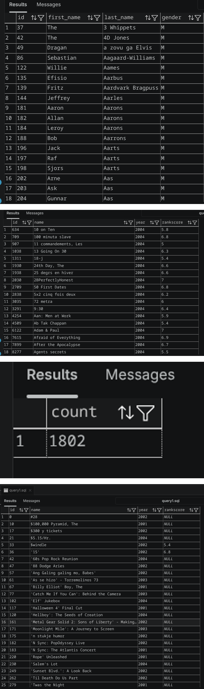
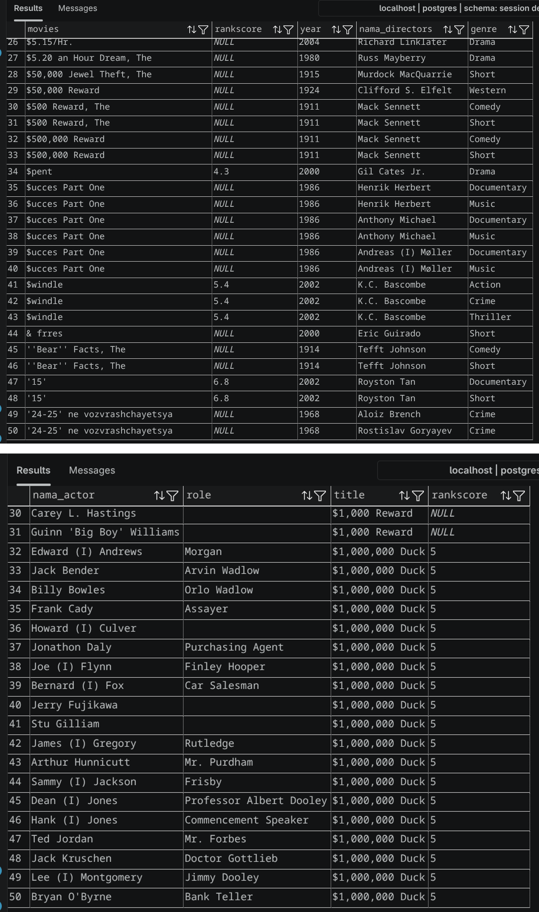
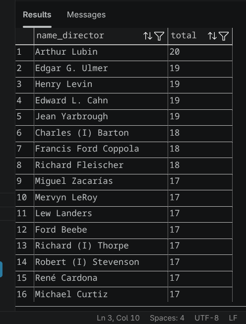
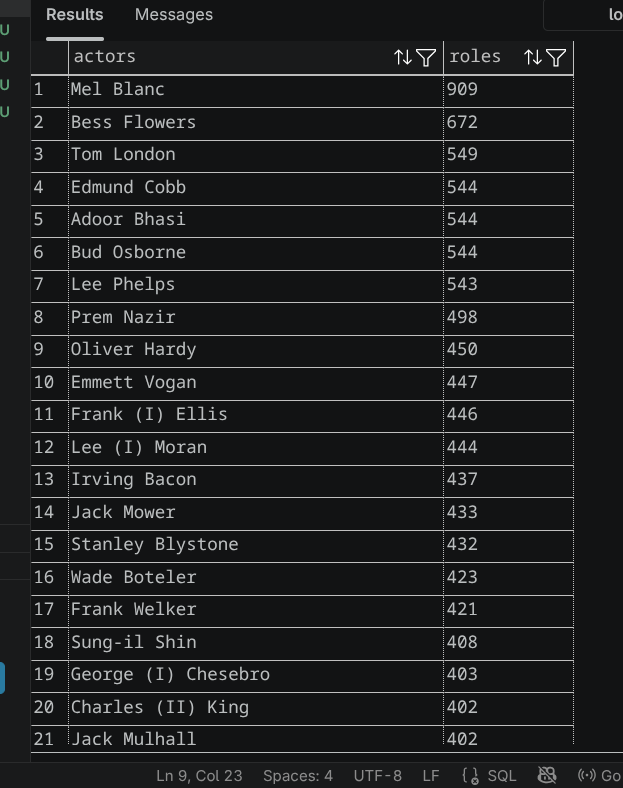
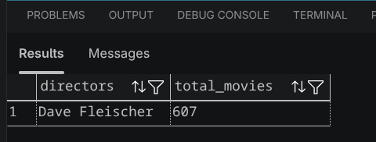
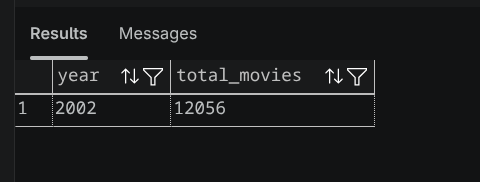
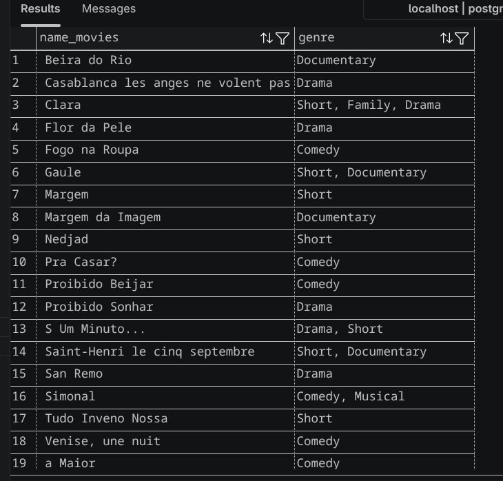

# SQL Query PostgreSQL Mengambil Data

## Penjelasan

Repository ini berisi beberapa query SQL untuk mengambil data berdasarkan kriteria tertentu serta menampilkan data dari beberapa tabel yang saling berelasi menggunakan `JOIN`.

---

## Screenshot Query 1



Berisi beberapa query SQL dasar menggunakan:

- `WHERE`
- `LIKE`
- `BETWEEN`
- `COUNT()`

---

## Screenshot Query 2



Pada query ini ditampilkan data aktor beserta peran (`role`), judul film, dan `rankscore` dengan menggabungkan beberapa tabel yang saling berelasi menggunakan `JOIN`.

Agar penulisan query lebih singkat dan mudah dibaca, setiap tabel diberikan alias.

Contoh:

```sql
FROM "actors" "a"
JOIN "roles" "rl"
JOIN "movies" "m"
```

Dengan menggunakan alias, pemanggilan kolom menjadi lebih jelas dan menghindari ambiguitas.

Contoh:

```sql
"m"."name" AS "title"
```

Selain itu, kolom `first_name` dan `last_name` pada tabel `actors` digabungkan menjadi satu kolom menggunakan fungsi `CONCAT`, sehingga nama aktor ditampilkan dalam satu kolom.

Contoh:

```sql
CONCAT("a"."first_name", ' ', "a"."last_name") AS "nama_actor"
```

---

## Screenshot Query 3

### Data Director dengan Jumlah Genre



### Data Actor dengan Role > 5



### Movies dengan Genres dalam Satu Kolom



### Data Director Paling Produktif



### Tahun Tersibuk dengan Jumlah Movies

